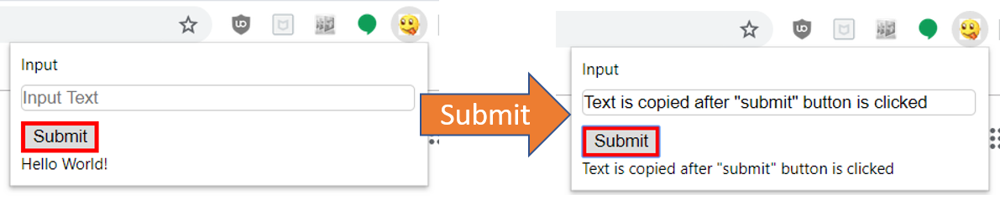

# Simple Chrome Extension to Invoke a AWS Lambda Function

Basic chrome extension that can be manually added to your Google Chrome Browser to invoke an AWS Lambda function. An input String is taken in and then passed to the Lambda function which then returns the original message that is passed by the user.


Figure 1: Chrome Extension

## Getting Started

These instructions will get you a copy of the project up and running on your local machine for development and testing purposes.

### Prerequisites

This tutorial assumes you have completed the following tasks:

```
1.  Installation and setup Google Chrome Browser
2.  Creation of an AWS account
```

### Installing the extension

Add the extension to the google chrome via "Load unpacked" and directing to the "Chrome" folder.

The extension should be added to the browser.

### Setting up a Lambda Function

*1a. Creation of the lambda function*

Upload the Python file found in the "lamda_function" directory, with interpreter set to Python 3.6.

Detailed instructions can be found in the [AWS documentation](https://docs.aws.amazon.com/lambda/latest/dg/getting-started-create-function.html)

*1b. Create and link an API to the function*

Create and add an API Gateway to the triggers of the lambda function for the "POST" method for the function

*1c. Editing the target url destination for the https request sent by extension*

in popup.js:
```javascript
const url = "https://<your-api-key>.execute-api.<region>.amazonaws.com/<deployment-stage>/<function-path>";
```

