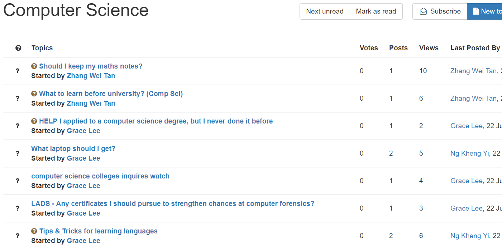
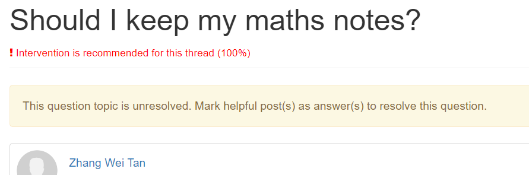
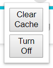
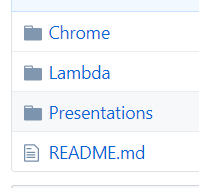

# Chrome Extension -- Instructor Intervention in MOOC Discussion Forums

*Updated as of 6 Aug 2019*

This Chrome Extension shows an example implementation of the predictive models which identif important threads from MOOC discussion forums (Coursemology). It prompts MOOC instructors on when to intervene in discussion forums when viewing the relevant webpage.

## Getting Started

These instructions will get you a copy of the project up and running on your local machine for development and testing purposes.

### Prerequisites

This tutorial assumes you have completed the following tasks:

```
1.  Installation and setup Google Chrome Browser
2.  Gained access to a forum in Coursemology
```

### Installing the extension

Add the extension to the google chrome via "Load unpacked" and directing to the "Chrome" folder.

The extension should be added to the browser.

### Using the extension

1. Visit the the forum page of any module on Coursemology
   
     On initial visit, the forum page will appear as such
     

2. Visit any of the threads listed on the forum pages. The probability of whether the thread requires intervention will be calculated and then displayed accordingly at the top of the webpage
     

3. Subsequently, returning to the main forum listings will show the updated results from processing the respective threads.
      
      

## Additional Features

Opening the extension panel reveals 2 buttons



### Clear Cache

Clears the memory of the the extension, mainly the results of processing the different forum threads


### Turning off the Extension

Toggles the extension between on/off, depending on its current state. (Browser page is required to be refreshed to take ef

# Appendix

## Github Repo Outline



*Repo folders (updated as of 8 Aug 2019)*


* **Chrome**: Contains files for the Google Chrome extension
* **Lambda**: Contains a copy of the code when an the extension makes an API call to AWS Lambda
* **Presentations**: Contains the presentation files regarding the project
* **README**: Documentation regarding project
